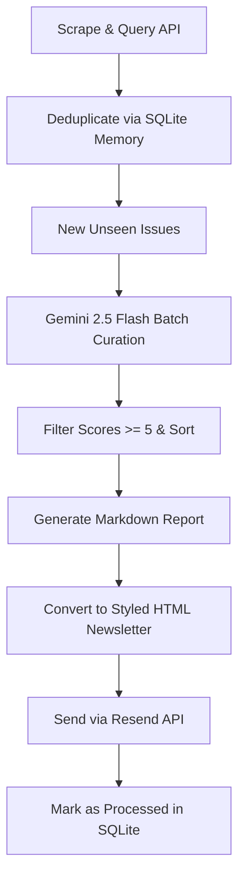

# IssueHawk 🦅
### Autonomous Open-Source GitHub Issue Curation Agent

IssueHawk is a lightweight, self-hosted, autonomous agent that curates, scores, ranks, and delivers relevant "good first issue" candidates from across GitHub directly to your inbox. 

By targeting websites like `goodfirstissue.dev` and `up-for-grabs.net` alongside the GitHub REST API, IssueHawk tracks a personalized profile of development preferences and presents a beautifully formatted daily or weekly summary of issues that fit your stack.

---

## 🚀 Key Features

*   **Multi-Source Scraper:** Crawls and aggregates open issues from `goodfirstissue.dev`, `up-for-grabs.net`, and the GitHub Search API.
*   **Gemini 2.5 Flash Intelligence:** Scores issues (0–10) and generates concise explanations of why they fit based on your exact profile/stack.
*   **Local Persistent Memory:** SQLite database handles issue deduplication to make sure you never receive the same issue twice.
*   **Premium HTML Emails:** Delivers a curated, styled newsletter of ranked issues to your inbox via the **Resend API**.
*   **Automation-Ready Schedulers:** Configurable chron scheduling with APScheduler or run-now command line executions.

---

## 🛠️ Architecture



---

## 📦 Setup & Installation

### 1. Clone & Install Dependencies
Ensure you have Python 3.9+ installed, then run:
```bash
pip install -r requirements.txt
```

### 2. Configure Environment Variables
Create a `.env` file in the root directory:
```env
# Gemini API Configuration
GEMINI_API_KEY="your-gemini-api-key"

# GitHub API Token (for searching/scraping)
GITHUB_TOKEN="your-github-personal-access-token"

# Resend API Configuration
RESEND_API_KEY="re_your-resend-api-key"
RECIPIENT_EMAIL="your-recipient-email@domain.com"
```

### 3. Customize Curation Preferences
Configure your execution cadence, target languages, and scheduling inside `config.py`:
*   `SCHEDULE_DAY`: Cadence of execution (e.g., `"daily"` or `"mon"`).
*   `SCHEDULE_HOUR`: The hour of the day to send reports (0–23, e.g., `18`).
*   `SCHEDULE_MINUTE`: The minute of the hour (0–59, e.g., `30`).
*   `SCHEDULE_TIMEZONE`: Timezone of execution (e.g., `"Asia/Kolkata"`).

The Gemini scoring profile is defined in `tools/llm.py` and is set to match intermediate developers with backgrounds in **FastAPI**, **LangGraph**, **React**, **Python async**, and **AI Agents**.

---

## 💻 CLI Usage

IssueHawk is operated entirely from the CLI.

#### 1. Dry Run / Run Immediately
Run the full pipeline (scrape -> deduplicate -> LLM score -> generate report -> email) immediately:
```bash
python main.py --run-now
```

#### 2. Test Resend Credentials
Send a test verification email to ensure your API keys and recipient email are configured correctly:
```bash
python main.py --test-mail
```

#### 3. Run Scheduler in Background
Keep the process running in the background to automatically execute on the cadence specified in `config.py`:
```bash
python main.py --schedule
```

---

## 🐳 Deployment Options

IssueHawk is ready for production and can be deployed using multiple strategies:

### Option A: Serverless via GitHub Actions (Recommended)
This runs the agent on GitHub's free tier without keeping any servers active. The SQLite database memory is stored directly inside your repository.

1. Push your repository to GitHub.
2. In your GitHub repository settings, go to **Settings > Secrets and variables > Actions** and add the following repository secrets:
   * `GEMINI_API_KEY`
   * `ACCESS_TOKEN_GITHUB`
   * `RESEND_API_KEY`
   * `RECIPIENT_EMAIL`
3. The workflow defined in `.github/workflows/curate.yml` runs everyday at 13:00 UTC (6:30 PM IST) and automatically pushes updated database state (`data/memory.db`) back to main.

### Option B: Containerized Docker Deployment
Ideal for self-hosted instances on Railway, Render, Fly.io, or your own VPS.

1. Build the Docker image:
   ```bash
   docker build -t issuehawk:latest .
   ```
2. Run the container:
   ```bash
   docker run -d \
     --name issuehawk \
     -v $(pwd)/data:/app/data \
     -v $(pwd)/reports:/app/reports \
     --env-file .env \
     issuehawk:latest
   ```
   *Note: Mounting the `/app/data` volume ensures your deduplication database persists between container restarts.*

---

## 📁 Project Structure

*   `main.py`: Central pipeline orchestrator and command-line execution entry point.
*   `config.py`: Environment-driven configuration module.
*   `tools/`
    *   `scraper.py`: Core scrapers (Crawl4AI + requests fallback) and normalization layer.
    *   `github_api.py`: Search queries & repository-level issue collectors.
    *   `llm.py`: Gemini client setup, batch issue scoring, and Pydantic schemas.
    *   `memory.py`: Database helper functions for deduplication tracking.
    *   `reporter.py`: Curation analyzer producing local Markdown archives.
    *   `mailer.py`: HTML converter and Resend API mail dispatch client.
*   `data/`: SQLite database storage (`memory.db`).
*   `reports/`: Historical archive of generated Markdown reports.
