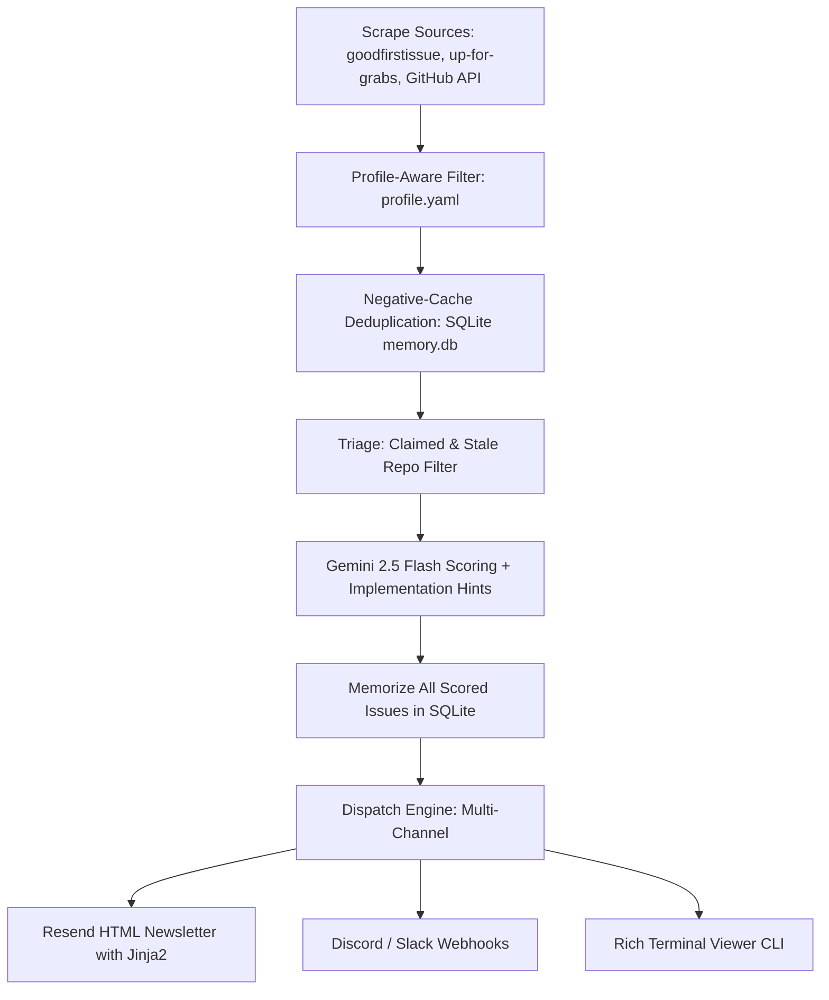

<p align="center">
  
</p>

<p align="center">
  <strong>Autonomous Open-Source GitHub Issue Curation & Triage Agent</strong>
</p>

IssueHawk is a self-hosted, autonomous agent that curates, scores, ranks, and delivers high-signal "good first issue" candidates from across GitHub directly to your inbox, Discord, or Slack.

By crawling `goodfirstissue.dev` and `up-for-grabs.net` alongside the GitHub Search API, IssueHawk matches issues against your customizable developer profile (`profile.yaml`), filters out claimed or stale issues, negative-caches irrelevant opportunities, and generates tactical implementation advice for every issue.

---

## 🚀 Key Features

*   **Customizable Developer Profiles (`profile.yaml`):** Easily tailor your tech stacks (FastAPI, React, LangGraph, Rust, etc.), seniority level, excluded labels, and score thresholds without editing code.
*   **Deep Curation Intelligence & Triage (`tools/triage.py`):** Automatically detects if an issue is already assigned, in-progress, or claimed in recent comments. Checks repository vitality to avoid abandoned projects.
*   **Gemini 2.5 Flash Architecture Mentorship:** Scores issues (0–10), specifies estimated difficulty (`beginner`, `intermediate`, `advanced`), and generates a concise **implementation hint** detailing where in the codebase to start.
*   **Token-Saving Negative Cache (`tools/memory.py`):** SQLite database persists both emailed issues (permanently) and rejected/low-scoring issues (with a 14-day TTL), saving 60–80% of LLM tokens on recurring runs.
*   **Multi-Channel Delivery (`tools/dispatchers.py`):** Delivers responsive Jinja2-styled HTML newsletters via **Resend API** and rich embeds to **Discord** and **Slack** channels via webhooks.
*   **Interactive Terminal Dashboard (`tools/viewer.py`):** Inspect recent reports directly inside your terminal using rich colorized tables with issue links and implementation tips.
*   **Full Pytest Suite:** Rigorous unit test coverage across profile loading, negative caching, triage detection, and webhook formatting.

---

## 🛠️ Architecture


```mermaid
graph TD
    A[Scrape Sources: goodfirstissue, up-for-grabs, GitHub API] --> B[Profile-Aware Filter: profile.yaml]
    B --> C[Negative-Cache Deduplication: SQLite memory.db]
    C --> D[Triage: Claimed & Stale Repo Filter]
    D --> E[Gemini 2.5 Flash Scoring + Implementation Hints]
    E --> F[Memorize All Scored Issues in SQLite]
    F --> G[Dispatch Engine: Multi-Channel]
    G --> H1[Resend HTML Newsletter with Jinja2]
    G --> H2[Discord / Slack Webhooks]
    G --> H3[Rich Terminal Viewer CLI]
```

---

## 📦 Setup & Installation

### 1. Clone & Install Dependencies
Ensure you have Python 3.11+ installed:
```bash
pip install -r requirements.txt
# Or using uv
uv sync
```

### 2. Configure Environment Variables
Create a `.env` file in the root directory:
```env
# Gemini API Configuration (Required for scoring)
GEMINI_API_KEY="your-gemini-api-key"

# GitHub API Token (Recommended for rate limits & comment triage)
GITHUB_TOKEN="your-github-personal-access-token"

# Resend API Configuration (Required for email newsletter)
RESEND_API_KEY="re_your-resend-api-key"
RECIPIENT_EMAIL="your-recipient-email@domain.com"

# Optional Webhooks (Discord & Slack)
DISCORD_WEBHOOK_URL="https://discord.com/api/webhooks/..."
SLACK_WEBHOOK_URL="https://hooks.slack.com/services/..."
```

### 3. Customize Developer Profile
Edit `profile.yaml` to specify your target frameworks, languages, and preferences:
```yaml
profile:
  name: "Full-Stack AI Developer"
  skill_level: "intermediate"
  skills:
    - "FastAPI"
    - "LangGraph"
    - "React"
    - "Python async"
  languages:
    - "python"
    - "typescript"
  min_score: 5
  max_results: 15
  filter_claimed: true
  filter_inactive_repos: true
```

---

## 💻 CLI Usage

IssueHawk provides a rich suite of command-line tools:

#### 1. Run Pipeline Immediately
Scrape, deduplicate, score, and dispatch to configured channels:
```bash
python main.py --run-now
# Or specify a custom profile
python main.py --run-now --profile my-profile.yaml
```

#### 2. Terminal Dashboard Viewer
View the latest curated report in a colorized terminal table:
```bash
python main.py --view
```

#### 3. Inspect Memory & Cache Stats
Check total issues tracked, emailed, and negative-cached:
```bash
python main.py --stats
```

#### 4. Test Notification Channels
Test Resend email credentials or Discord/Slack webhooks:
```bash
python main.py --test-mail
python main.py --test-webhooks
```

#### 5. Background Scheduler
Run IssueHawk as a background daemon on the cadence configured in `config.py`:
```bash
python main.py --schedule
```

---

## 🧪 Testing

Run the automated test suite with `pytest`:
```bash
pytest -v tests/
# Or with uv
uv run pytest -v tests/
```

---

## 🐳 Deployment Options

### Option A: Serverless via GitHub Actions (Recommended)
This runs the agent on GitHub's free tier without keeping any servers active. The SQLite database memory is stored directly inside your repository.

1. Push your repository to GitHub.
2. In your GitHub repository settings, go to **Settings > Secrets and variables > Actions** and add:
   * `GEMINI_API_KEY`
   * `ACCESS_TOKEN_GITHUB`
   * `RESEND_API_KEY`
   * `RECIPIENT_EMAIL`
   * *(Optional)* `DISCORD_WEBHOOK_URL` / `SLACK_WEBHOOK_URL`
3. The workflow defined in `.github/workflows/curate.yml` runs everyday at 13:00 UTC (6:30 PM IST) and automatically pushes updated database state (`data/memory.db`) back to main.

### Option B: Containerized Docker Deployment
```bash
docker build -t issuehawk:latest .
docker run -d \
  --name issuehawk \
  -v $(pwd)/data:/app/data \
  -v $(pwd)/reports:/app/reports \
  --env-file .env \
  issuehawk:latest
```

---

## 📁 Project Structure

*   `main.py`: Central pipeline orchestrator and CLI entry point.
*   `profile.yaml`: Dynamic configuration for developer tech stack and filters.
*   `config.py`: Environment-driven configuration module.
*   `templates/`
    *   `newsletter.html.j2`: Responsive Jinja2 email newsletter template.
*   `tools/`
    *   `profile.py`: Profile loader and dynamic prompt builder.
    *   `triage.py`: Claimed/in-progress issue detection and repo vitality checks.
    *   `llm.py`: Gemini client, batch scoring, implementation hints, and difficulty ratings.
    *   `memory.py`: SQLite persistent memory with 14-day TTL negative caching and stats.
    *   `dispatchers.py`: Discord and Slack webhook dispatch handlers.
    *   `viewer.py`: Rich terminal dashboard table renderer.
    *   `scraper.py`: Multi-source scrapers (`goodfirstissue.dev`, `up-for-grabs.net`, GitHub API).
    *   `github_api.py`: Search queries & repository collectors.
    *   `reporter.py`: Markdown curation analyzer and archiver.
    *   `mailer.py`: Jinja2-based HTML converter and Resend API mail dispatch client.
*   `tests/`: Comprehensive automated test suite for all modules.
*   `data/`: SQLite database storage (`memory.db`).
*   `reports/`: Historical archive of generated Markdown reports.
