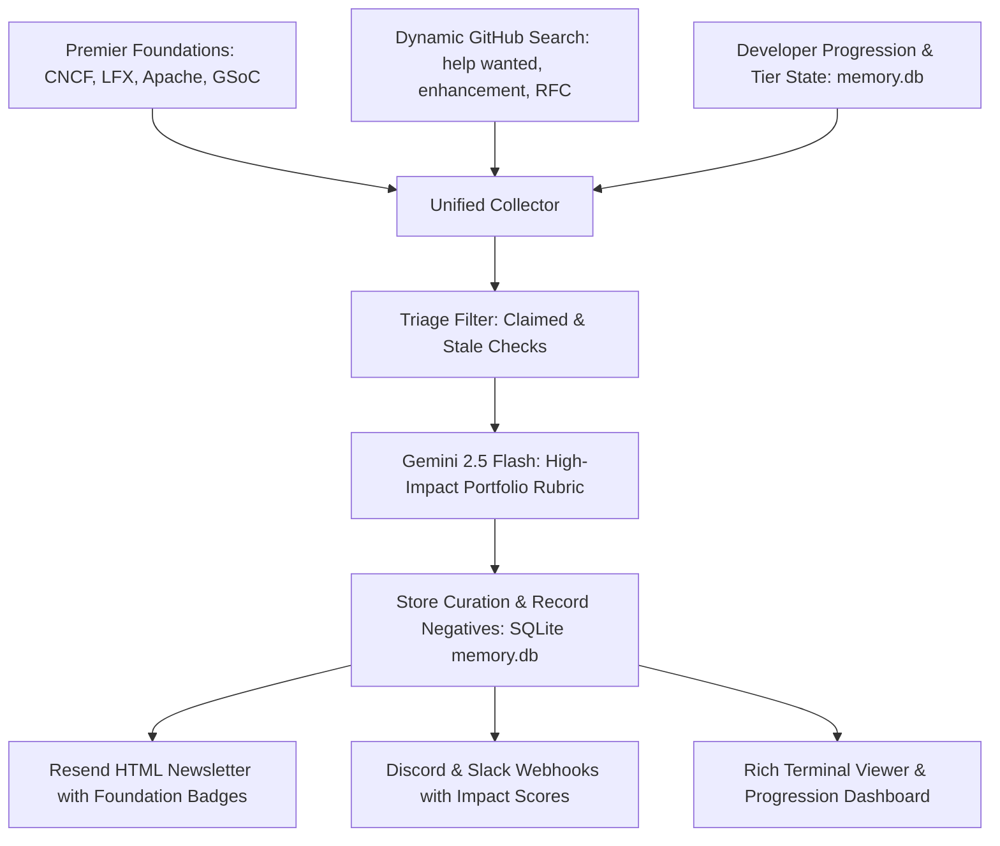

<p align="center">
  <picture>
    <source media="(prefers-color-scheme: dark)" srcset="assets/logo-dark.svg">
    <source media="(prefers-color-scheme: light)" srcset="assets/logo.svg">
    
  </picture>
</p>

<p align="center">
  <strong>Autonomous Career Accelerator & Open-Source Issue Curation Agent (LFX / GSoC Ready)</strong>
</p>

IssueHawk is an evolving, autonomous open-source career accelerator that transitions developers from beginner "good first issue" starters into high-impact core contributors ready for prestigious programs like **LFX Mentorship (Linux Foundation)**, **Google Summer of Code (GSoC)**, and **CNCF / Apache** foundations.

Unlike static scrapers that lock you in beginner loops, IssueHawk tracks your developer progression, queries premier open-source foundations (CNCF, LFX, Apache, GSoC), evaluates architectural depth using a **High-Impact Portfolio Rubric**, and delivers curated opportunities directly to your inbox, Discord, Slack, and terminal.

---

## 🚀 Key Features

*   **📈 Developer Progression Engine (`tools/evolution.py`):** Automatically tracks experience points (XP), graduates your skill tier (`Apprentice` ➔ `Contributor` ➔ `Core Contributor` ➔ `Mentorship Ready`), and syncs merged PRs from your GitHub profile.
*   **🏛️ Curated Premier Foundations Registry (`tools/registry.py`):** Direct pipelines targeting premier open-source foundations: **CNCF** (*Kubernetes, Prometheus, Envoy*), **Linux Foundation / LFX** (*Hyperledger, GraphQL, OpenTelemetry*), **Apache** (*Airflow, Spark, Arrow, Kafka*), and top **GSoC** organizations.
*   **🎯 High-Impact Portfolio Rubric (`tools/llm.py`):** Gemini 2.5 Flash evaluates architectural and subsystem depth (multi-file logic, concurrency, API design) and scores **Portfolio / Mentorship Uplift (1–10)**, filtering out trivial single-line or typo fixes.
*   **🛠️ Interactive CLI Milestone Commands:**
    *   `--progress`: Inspect your current tier, XP progress bar, merged PRs, and milestones.
    *   `--complete <url>`: Record completed issues to earn XP and trigger tier promotions.
    *   `--sync-profile`: Automatically query GitHub for your merged PRs to boost your standing.
*   **🧠 Token-Saving Negative Cache (`tools/memory.py`):** SQLite database persists both completed/emailed contributions and negative-cached non-matches, reducing LLM token consumption on recurring runs.
*   **📬 Multi-Channel Delivery:** Responsive Jinja2-styled HTML newsletters via **Resend API** and rich embeds to **Discord** and **Slack** channels with program badges (`[CNCF]`, `[LFX]`, `[Apache]`, `[GSoC]`).
*   **🧪 100% Passing Automated Test Suite:** Unit and integration tests covering profile parsing, triage, negative caching, progression graduation, and foundation catalogs.

---

## 🛠️ Architecture


```mermaid
graph TD
    A[Premier Foundations: CNCF, LFX, Apache, GSoC] --> D[Unified Collector]
    B[Dynamic GitHub Search: help wanted, enhancement, RFC] --> D
    C[Developer Progression & Tier State: memory.db] --> D
    D --> E[Triage Filter: Claimed & Stale Checks]
    E --> F[Gemini 2.5 Flash: High-Impact Portfolio Rubric]
    F --> G[Store Curation & Record Negatives: SQLite memory.db]
    G --> H1[Resend HTML Newsletter with Foundation Badges]
    G --> H2[Discord & Slack Webhooks with Impact Scores]
    G --> H3[Rich Terminal Viewer & Progression Dashboard]
```

---

## 🎖️ Progression Tiers

| Tier | Title | Target Scope & Labels | Programs & Foundations |
|---|---|---|---|
| **Level 1** | `Apprentice` | `good first issue`, `beginner-friendly`, setup docs | Community starters, goodfirstissue.dev |
| **Level 2** | `Contributor` | `help wanted`, `bug`, `enhancement` | Broad open source, up-for-grabs |
| **Level 3** | `Core Contributor` | `enhancement`, `feature`, `performance`, `refactor` | CNCF, Apache, GSoC core modules |
| **Level 4** | `Mentorship Ready` | `lfx-mentorship`, `gsoc`, `RFC`, `core`, `subsystem` | LFX Mentorship, GSoC, Linux Foundation |

---

## 📦 Setup & Installation

### 1. Install Dependencies
```bash
# Using uv (Recommended)
uv sync

# Or standard pip
pip install -r requirements.txt
```

### 2. Configure Environment Variables
Create a `.env` file in the root directory:
```env
# Gemini API Configuration (Required for scoring & implementation hints)
GEMINI_API_KEY="your-gemini-api-key"

# GitHub API Token (Recommended for rate limits & comment triage)
ACCESS_TOKEN_GITHUB="your-github-personal-access-token"

# Resend API Configuration (Required for email newsletter)
RESEND_API_KEY="re_your-resend-api-key"
RECIPIENT_EMAIL="your-recipient-email@domain.com"

# Optional Webhooks (Discord & Slack)
DISCORD_WEBHOOK_URL="https://discord.com/api/webhooks/..."
SLACK_WEBHOOK_URL="https://hooks.slack.com/services/..."
```

### 3. Customize Developer Profile
Configure `profile.yaml`:
```yaml
profile:
  name: "Growth Developer"
  github_username: "your-github-username"
  tier: "core_contributor" # apprentice | contributor | core_contributor | mentorship_ready
  auto_graduate: true
  track: "lfx_gsoc_ready"

  target_foundations:
    - "cncf"
    - "lfx"
    - "apache"
    - "gsoc"

  skills:
    - "FastAPI"
    - "LangGraph"
    - "React"
    - "Python async"
  languages:
    - "python"
    - "typescript"
  min_score: 6
  max_results: 15
```

---

## 💻 CLI Usage

#### 1. Inspect Your Developer Progression & XP
```bash
uv run python main.py --progress
```

#### 2. Run High-Impact Curation Pipeline Immediately
```bash
uv run python main.py --run-now
# Force re-evaluation bypassing memory cache
uv run python main.py --run-now --force
```

#### 3. Mark an Issue Completed & Earn XP
```bash
uv run python main.py --complete https://github.com/kubernetes/kubernetes/issues/112450
```

#### 4. Auto-Sync Merged PRs from GitHub
```bash
uv run python main.py --sync-profile
```

#### 5. View Latest Curated Report in Terminal
```bash
uv run python main.py --view
```

#### 6. Test Newsletter & Webhook Dispatches
```bash
uv run python main.py --test-mail
uv run python main.py --test-webhooks
```

#### 7. Start Scheduled Daemon
```bash
uv run python main.py --schedule
```

---

## 🧪 Testing

Run the comprehensive pytest suite:
```bash
uv run pytest -v
```
